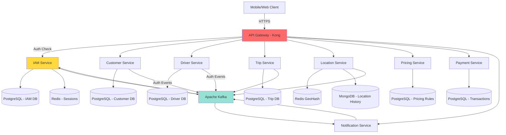
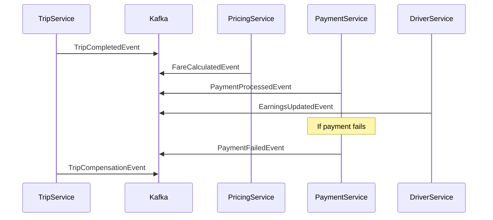
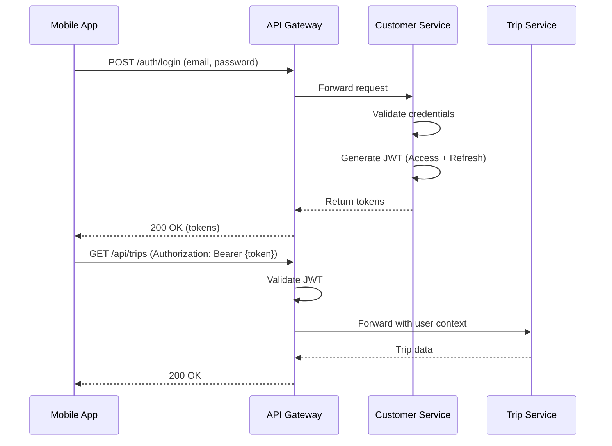
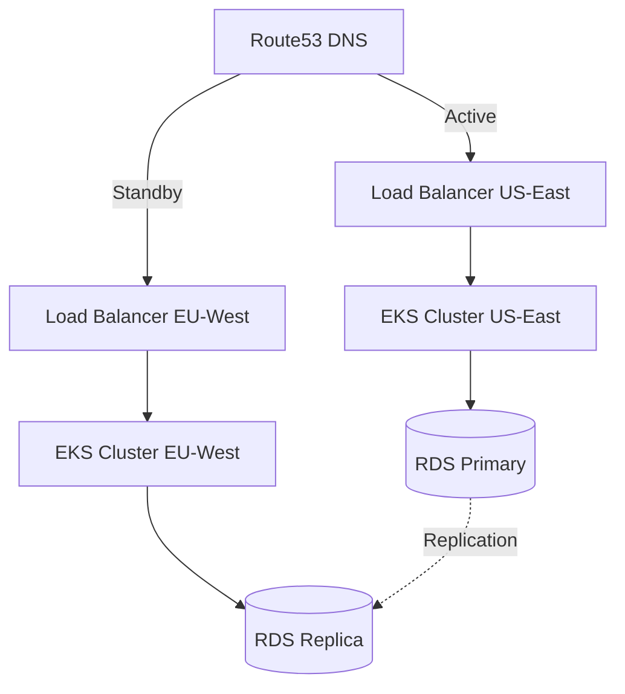

# Production-Ready Ride-Hailing Microservices Architecture

## Overview

This document outlines a comprehensive, production-ready architecture for a ride-hailing system (similar to Grab/Uber) using modern microservices patterns, Domain-Driven Design (DDD), and best practices for scalability, resilience, and maintainability.

### Key Business Requirements
- **Real-time Driver Matching**: Find 5 nearest drivers within 2km radius
- **Live Tracking**: Update driver locations every 3-5 seconds for thousands of drivers
- **Dynamic Pricing**: Calculate fares based on distance, time, and surge multipliers
- **High Availability**: 99.9% uptime for critical services
- **Scalability**: Support thousands of concurrent trips

---

## Technology Stack

### Backend Services
| Layer | Technology | Purpose |
|-------|-----------|---------|
| **Language** | Java 21 + Spring Boot 3.2+ | Microservices implementation |
| **Build Tool** | Gradle | Dependency management |
| **Database** | PostgreSQL (Primary), MongoDB (Location history) | Persistent storage |
| **Cache** | Redis with GeoHash | Geospatial queries, session management |
| **Message Broker** | Apache Kafka | Event-driven architecture |
| **Search** | Elasticsearch | Trip history, analytics |

### Infrastructure & DevOps
| Component | Technology | Purpose |
|-----------|-----------|---------|
| **API Gateway** | Kong / Spring Cloud Gateway | Routing, rate limiting, authentication |
| **Service Mesh** | Istio | Traffic management, observability, security |
| **Container Runtime** | Docker | Containerization |
| **Orchestration** | Kubernetes (K8s) | Container orchestration, auto-scaling |
| **Service Discovery** | Kubernetes DNS + Consul | Service registration & discovery |
| **Config Management** | Spring Cloud Config + Kubernetes ConfigMaps | Centralized configuration |
| **Load Balancer** | Nginx Ingress Controller | L7 load balancing |

### Observability & Monitoring
| Tool | Purpose |
|------|---------|
| **Distributed Tracing** | Jaeger / Tempo |
| **Logging** | ELK Stack (Elasticsearch, Logstash, Kibana) |
| **Metrics** | Prometheus + Grafana |
| **APM** | Spring Boot Actuator + Micrometer |

### Real-time Communication
| Technology | Use Case |
|-----------|----------|
| **WebSocket** | Client real-time updates (trip status, driver location) |
| **gRPC** | Inter-service communication (low latency) |
| **Server-Sent Events (SSE)** | One-way real-time notifications |

---

## Microservices Architecture

### Core Services



### Service Breakdown

#### 1. **IAM Service** (Port: 8080)
**Bounded Context**: Identity & Access Management
- User authentication (OAuth2, JWT, SSO)
- Authorization & permission management
- Role-based access control (RBAC)
- Multi-factor authentication (MFA)
- Session management
- Token management & rotation
- Password policies & security

**Database**: PostgreSQL
```sql
-- Key entities
users (id, username, email, password_hash, status, created_at)
roles (id, name, description)
permissions (id, resource, action, description)
role_permissions (role_id, permission_id)
user_roles (user_id, role_id)
user_sessions (id, user_id, token_hash, device_info, expires_at)
refresh_tokens (id, user_id, token_hash, family_id, expires_at)
mfa_devices (id, user_id, type, secret, verified_at)
oauth_clients (id, client_id, client_secret, redirect_uris)
```

**APIs**:
- `POST /api/auth/register` (User registration)
- `POST /api/auth/login` (Login with credentials)
- `POST /api/auth/oauth2/authorize` (OAuth2 authorization)
- `POST /api/auth/oauth2/token` (Token exchange)
- `POST /api/auth/refresh` (Refresh access token)
- `POST /api/auth/logout` (Logout & invalidate session)
- `POST /api/auth/mfa/enable` (Enable MFA)
- `POST /api/auth/mfa/verify` (Verify MFA code)
- `GET /api/auth/validate` (Validate token - internal)
- `POST /api/roles` (Create role)
- `POST /api/permissions` (Assign permissions)
- `GET /api/users/{id}/permissions` (Get user permissions)

**Security Features**:
- Bcrypt password hashing (cost factor 12)
- JWT with RS256 signing
- Token rotation on refresh
- Refresh token families (detect token theft)
- Rate limiting on login attempts
- Account lockout after failed attempts
- IP whitelist/blacklist
- Device fingerprinting
- Audit logging for all auth events

**Events Published**:
- `UserRegistered`, `UserLoggedIn`, `UserLoggedOut`
- `PasswordChanged`, `MFAEnabled`, `TokenRefreshed`
- `SuspiciousActivityDetected`, `AccountLocked`

---

#### 2. **Customer Service** (Port: 8081)
**Bounded Context**: Customer Management
- Profile management
- Trip history viewing
- Ratings & reviews
- Preferences management

**Database**: PostgreSQL
```sql
-- Key entities
customers (id, user_id, phone, name, created_at)
customer_profiles (customer_id, avatar_url, preferences, home_address, work_address)
customer_payment_methods (id, customer_id, type, details_encrypted)
customer_favorites (id, customer_id, location_name, lat, lng)
```

**APIs**:
- `GET /api/customers/{id}/profile`
- `PUT /api/customers/{id}/profile`
- `GET /api/customers/{id}/trips`
- `POST /api/customers/{id}/ratings`

**Note**: Authentication moved to IAM Service. Customer Service receives user context from IAM.

---

#### 3. **Driver Service** (Port: 8082)
**Bounded Context**: Driver Management
- Driver onboarding & verification
- Vehicle management
- Availability status management
- Earnings & performance tracking

**Database**: PostgreSQL
```sql
-- Key entities
drivers (id, email, phone, name, status, created_at)
driver_documents (driver_id, type, url, verified_at)
vehicles (id, driver_id, plate_number, model, year)
driver_availability (driver_id, is_online, updated_at)
```

**APIs**:
- `POST /api/drivers/register`
- `PUT /api/drivers/{id}/status` (online/offline)
- `GET /api/drivers/{id}/earnings`
- `PUT /api/drivers/{id}/location`

---

#### 4. **Location Service** (Port: 8083)
**Bounded Context**: Geospatial & Tracking
- Real-time driver location updates (every 3-5 seconds)
- Geospatial queries (find nearby drivers)
- Location history storage
- Route tracking

**Database**: 
- **Redis GeoHash**: Real-time driver locations
- **MongoDB**: Location history (time-series data)

**Redis GeoHash Commands**:
```bash
# Add driver location
GEOADD drivers:locations {longitude} {latitude} {driver_id}

# Find drivers within 2km
GEORADIUS drivers:locations {customer_lng} {customer_lat} 2 km WITHDIST COUNT 5 ASC
```

**APIs**:
- `POST /api/locations/drivers/{driverId}` (Update location)
- `GET /api/locations/nearby?lat={lat}&lng={lng}&radius=2000` (Find nearby drivers)
- `GET /api/locations/drivers/{driverId}/history`
- `WebSocket /ws/location/track/{tripId}` (Real-time tracking)

**Tech Details**:
- Use Spring Data Redis with GeoOperations
- Implement location update batching for efficiency
- TTL for inactive drivers (5 minutes)

---

#### 5. **Trip Service** (Port: 8084)
**Bounded Context**: Trip Orchestration
- Trip creation & matching algorithm
- Trip lifecycle management (requested → accepted → started → completed)
- Driver-customer matching
- Trip cancellation handling

**Database**: PostgreSQL
```sql
-- Key entities
trips (id, customer_id, driver_id, status, origin, destination, created_at)
trip_waypoints (trip_id, sequence, lat, lng, timestamp)
trip_matching_requests (trip_id, driver_id, status, expired_at)
```

**Matching Algorithm**:
1. Customer requests trip → Publish `TripRequested` event
2. Query Location Service for 5 nearest drivers within 2km
3. Send matching requests to drivers (15-second timeout each)
4. First driver to accept wins → Update trip status
5. If all reject → Expand radius to 5km and retry

**State Machine**:
```
REQUESTED → MATCHING → ACCEPTED → DRIVER_ARRIVING → 
TRIP_STARTED → TRIP_COMPLETED → PAYMENT_PROCESSED
```

**APIs**:
- `POST /api/trips` (Request trip)
- `PUT /api/trips/{id}/accept` (Driver accepts)
- `PUT /api/trips/{id}/start`
- `PUT /api/trips/{id}/complete`
- `DELETE /api/trips/{id}` (Cancel trip)

**Events Published**:
- `TripRequested`, `TripMatched`, `TripStarted`, `TripCompleted`, `TripCancelled`

---

#### 6. **Pricing Service** (Port: 8085)
**Bounded Context**: Fare Calculation
- Base fare + distance + time calculation
- Surge pricing based on demand
- Promotional discounts
- Fare estimation before trip

**Database**: PostgreSQL
```sql
-- Key entities
pricing_rules (id, city_id, base_fare, per_km_rate, per_minute_rate)
surge_multipliers (id, area_geohash, multiplier, start_time, end_time)
promotions (id, code, discount_type, discount_value, valid_until)
```

**Calculation Formula**:
```
Total Fare = (Base Fare + Distance * Per-KM Rate + Time * Per-Minute Rate) 
             * Surge Multiplier 
             - Discount
```

**APIs**:
- `POST /api/pricing/estimate` (Calculate estimated fare)
- `POST /api/pricing/calculate` (Finalize actual fare after trip)
- `GET /api/pricing/surge?lat={lat}&lng={lng}` (Get current surge)

---

#### 7. **Payment Service** (Port: 8086)
**Bounded Context**: Payment Processing
- Integration with payment gateways (Stripe, PayPal)
- Wallet management
- Transaction history
- Refund processing

**Database**: PostgreSQL
```sql
-- Key entities
wallets (id, customer_id, balance, currency)
transactions (id, trip_id, amount, type, status, gateway_ref)
payment_methods (id, customer_id, type, details_encrypted)
```

**APIs**:
- `POST /api/payments/charge`
- `POST /api/payments/refund`
- `GET /api/payments/transactions/{customerId}`

**Events Consumed**: `TripCompleted` → Charge customer

---

#### 8. **Notification Service** (Port: 8087)
**Bounded Context**: Real-time Notifications
- Push notifications (Firebase Cloud Messaging)
- SMS notifications (Twilio)
- Email notifications
- In-app WebSocket notifications

**Database**: MongoDB (notification logs)

**APIs**:
- `POST /api/notifications/send`
- `WebSocket /ws/notifications/{userId}`

**Events Consumed**: All trip events, payment events

---

#### 9. **Analytics Service** (Port: 8088)
**Bounded Context**: Business Intelligence & Reporting
- Real-time trip analytics
- Driver performance metrics
- Revenue reporting
- Demand forecasting
- Heat maps for high-demand areas

**Database**: ClickHouse (columnar database for analytics)

**Data Sources**:
- Kafka event streams (real-time)
- PostgreSQL replicas (batch processing)

**APIs**:
- `GET /api/analytics/trips/stats` (Trip statistics)
- `GET /api/analytics/revenue/daily` (Revenue reports)
- `GET /api/analytics/heatmap` (Demand heat map)
- `GET /api/analytics/drivers/{id}/performance`

**Tech Stack**:
- Apache Flink for stream processing
- Apache Superset for dashboards
- ClickHouse for OLAP queries

---

## Cross-Cutting Patterns

### 1. Domain-Driven Design (DDD)

Each service follows DDD tactical patterns:

**Layered Architecture**:
```
presentation/
├── controllers/    # REST/gRPC endpoints
├── dto/           # Data Transfer Objects
infrastructure/
├── persistence/   # JPA repositories, entities
├── messaging/     # Kafka producers/consumers
├── external/      # Third-party API clients
domain/
├── model/         # Domain entities, value objects
├── service/       # Domain services
├── event/         # Domain events
├── repository/    # Repository interfaces
application/
├── service/       # Application services (use cases)
├── command/       # Commands (CQRS)
├── query/         # Queries (CQRS)
```

**Example - Trip Domain Model**:
```java
// Domain Entity
@Entity
public class Trip {
    @Id
    private TripId id; // Value Object
    private CustomerId customerId;
    private DriverId driverId;
    private Location origin; // Value Object
    private Location destination;
    private TripStatus status; // Enum
    private Money fare; // Value Object
    
    // Domain behavior
    public void accept(DriverId driverId) {
        if (this.status != TripStatus.MATCHING) {
            throw new InvalidTripStateException();
        }
        this.driverId = driverId;
        this.status = TripStatus.ACCEPTED;
        // Publish domain event
        DomainEventPublisher.publish(new TripAcceptedEvent(this));
    }
}
```

---

### 2. CQRS (Command Query Responsibility Segregation)

Separate read and write models for high scalability:

**Write Model** (PostgreSQL):
- Handles commands (create, update, delete)
- Strong consistency
- Complex business logic

**Read Model** (Elasticsearch):
- Optimized for queries (trip history, search)
- Eventually consistent
- Denormalized data

**Implementation**:
```java
// Command
@Service
public class TripCommandService {
    public TripId createTrip(CreateTripCommand cmd) {
        // Validate & create trip
        Trip trip = new Trip(cmd);
        tripRepository.save(trip);
        
        // Publish event to update read model
        eventPublisher.publish(new TripCreatedEvent(trip));
        return trip.getId();
    }
}

// Query
@Service
public class TripQueryService {
    public List<TripDto> getTripHistory(CustomerId customerId) {
        // Query from Elasticsearch
        return elasticsearchRepository.findByCustomerId(customerId);
    }
}
```

---

### 3. Event Sourcing (For Trip Service)

Store all state changes as events:

```java
// Event Store
@Entity
public class TripEvent {
    @Id
    private UUID id;
    private TripId tripId;
    private String eventType; // TripCreated, TripAccepted, etc.
    private String eventData; // JSON payload
    private Instant timestamp;
}

// Rebuild trip state from events
public Trip rebuildFromEvents(TripId tripId) {
    List<TripEvent> events = eventStore.findByTripId(tripId);
    Trip trip = new Trip();
    events.forEach(event -> trip.apply(event));
    return trip;
}
```

---

### 4. Saga Pattern (Distributed Transactions)

**Use Case**: Trip Completion Flow
1. Complete trip (Trip Service)
2. Calculate fare (Pricing Service)
3. Charge customer (Payment Service)
4. Update driver earnings (Driver Service)

**Choreography-based Saga**:


**Orchestration-based Saga** (Alternative):
```java
@Service
public class TripCompletionSagaOrchestrator {
    public void orchestrateCompletion(TripId tripId) {
        try {
            // Step 1
            fareCalculationService.calculate(tripId);
            // Step 2
            paymentService.charge(tripId);
            // Step 3
            driverService.updateEarnings(tripId);
        } catch (Exception e) {
            // Compensating transactions
            compensate(tripId);
        }
    }
}
```

---

### 5. Outbox Pattern (Transactional Messaging)

**Problem**: Ensure atomic transaction between database writes and event publishing.

**Solution**: Store events in an outbox table within the same database transaction, then publish asynchronously.

#### Implementation

**Outbox Table Schema** (in each service database):
```sql
CREATE TABLE outbox_events (
    id UUID PRIMARY KEY DEFAULT gen_random_uuid(),
    aggregate_type VARCHAR(255) NOT NULL,
    aggregate_id VARCHAR(255) NOT NULL,
    event_type VARCHAR(255) NOT NULL,
    event_payload JSONB NOT NULL,
    created_at TIMESTAMP NOT NULL DEFAULT NOW(),
    published_at TIMESTAMP NULL,
    status VARCHAR(50) NOT NULL DEFAULT 'PENDING', -- PENDING, PUBLISHED, FAILED
    retry_count INT NOT NULL DEFAULT 0,
    error_message TEXT NULL
);

CREATE INDEX idx_outbox_status_created ON outbox_events(status, created_at) 
WHERE status = 'PENDING';
```

**Example: Trip Service**
```java
// Domain Service
@Service
@Transactional
public class TripService {
    @Autowired
    private TripRepository tripRepository;
    
    @Autowired
    private OutboxEventRepository outboxRepository;
    
    public TripId createTrip(CreateTripCommand command) {
        // 1. Save trip to database
        Trip trip = new Trip(command);
        tripRepository.save(trip);
        
        // 2. Save domain event to outbox (same transaction)
        OutboxEvent event = OutboxEvent.builder()
            .aggregateType("Trip")
            .aggregateId(trip.getId().toString())
            .eventType("TripCreated")
            .eventPayload(toJson(new TripCreatedEvent(trip)))
            .status(OutboxStatus.PENDING)
            .build();
        outboxRepository.save(event);
        
        // Transaction commits - both trip and event saved atomically
        return trip.getId();
    }
}

// Outbox Publisher (runs every 1 second)
@Component
public class OutboxPublisher {
    @Autowired
    private OutboxEventRepository outboxRepository;
    
    @Autowired
    private KafkaTemplate<String, String> kafkaTemplate;
    
    @Scheduled(fixedDelay = 1000)
    @Transactional
    public void publishPendingEvents() {
        List<OutboxEvent> pendingEvents = outboxRepository
            .findTop100ByStatusOrderByCreatedAtAsc(OutboxStatus.PENDING);
        
        for (OutboxEvent event : pendingEvents) {
            try {
                // Publish to Kafka
                kafkaTemplate.send(
                    event.getAggregateType().toLowerCase() + "-events",
                    event.getAggregateId(),
                    event.getEventPayload()
                ).get(5, TimeUnit.SECONDS);
                
                // Mark as published
                event.setStatus(OutboxStatus.PUBLISHED);
                event.setPublishedAt(Instant.now());
                outboxRepository.save(event);
                
            } catch (Exception e) {
                // Retry logic
                event.setRetryCount(event.getRetryCount() + 1);
                event.setErrorMessage(e.getMessage());
                
                if (event.getRetryCount() >= 5) {
                    event.setStatus(OutboxStatus.FAILED);
                    // Send to DLQ or alert
                }
                outboxRepository.save(event);
            }
        }
    }
}
```

**Alternative: Debezium CDC** (Change Data Capture)
```yaml
# Automatically publish outbox events without polling
# Debezium connector config
connector.class: io.debezium.connector.postgresql.PostgresConnector
database.hostname: postgres
database.dbname: trip_db
table.include.list: public.outbox_events
transforms: outbox
transforms.outbox.type: io.debezium.transforms.outbox.EventRouter
transforms.outbox.table.field.event.id: id
transforms.outbox.table.field.event.key: aggregate_id
transforms.outbox.table.field.event.type: event_type
transforms.outbox.table.field.event.payload: event_payload
```

**Benefits**:
- ✅ Guaranteed event delivery (at-least-once)
- ✅ No dual-write problem
- ✅ Event ordering per aggregate
- ✅ Automatic retry with exponential backoff

---

### 6. Anti-Corruption Layer (ACL)

**Purpose**: Translate between external systems and internal domain models to prevent external APIs from corrupting our domain.

#### Use Case 1: Payment Gateway Integration

External payment providers (Stripe, PayPal) have different APIs. ACL provides unified interface.

```java
// Domain Model (Internal)
public class Payment {
    private PaymentId id;
    private Money amount;
    private PaymentStatus status; // PENDING, COMPLETED, FAILED
    private String customerId;
}

// Anti-Corruption Layer
@Component
public class PaymentGatewayAdapter {
    @Autowired
    private StripeClient stripeClient;
    
    @Autowired
    private PayPalClient paypalClient;
    
    public Payment processPayment(PaymentRequest request) {
        // Determine gateway
        PaymentGateway gateway = request.getGateway();
        
        // Translate to external format and call
        ExternalPaymentResponse response = switch (gateway) {
            case STRIPE -> processWithStripe(request);
            case PAYPAL -> processWithPayPal(request);
        };
        
        // Translate back to domain model
        return toDomainModel(response);
    }
    
    private ExternalPaymentResponse processWithStripe(PaymentRequest request) {
        // Translate domain model to Stripe API format
        ChargeCreateParams params = ChargeCreateParams.builder()
            .setAmount(request.getAmount().getCents())
            .setCurrency(request.getAmount().getCurrency().toLowerCase())
            .setSource(request.getPaymentMethodToken())
            .build();
        
        Charge charge = stripeClient.charges().create(params);
        
        // Return unified format
        return new ExternalPaymentResponse(
            charge.getId(),
            charge.getAmount(),
            mapStripeStatus(charge.getStatus())
        );
    }
    
    private Payment toDomainModel(ExternalPaymentResponse response) {
        return Payment.builder()
            .id(new PaymentId(response.getExternalId()))
            .amount(Money.of(response.getAmount(), Currency.USD))
            .status(response.getStatus())
            .build();
    }
}
```

#### Use Case 2: Google Maps API Integration

```java
// Domain Service
public interface RouteCalculator {
    Route calculateRoute(Location origin, Location destination);
}

// ACL Implementation
@Component
public class GoogleMapsRouteAdapter implements RouteCalculator {
    @Autowired
    private GoogleMapsClient mapsClient;
    
    @Override
    public Route calculateRoute(Location origin, Location destination) {
        // Call external API
        DirectionsResult result = mapsClient.directions(
            new LatLng(origin.getLatitude(), origin.getLongitude()),
            new LatLng(destination.getLatitude(), destination.getLongitude())
        ).await();
        
        // Translate to domain model
        DirectionsRoute gmapsRoute = result.routes[0];
        
        return Route.builder()
            .distance(Distance.ofMeters(gmapsRoute.legs[0].distance.inMeters))
            .duration(Duration.ofSeconds(gmapsRoute.legs[0].duration.inSeconds))
            .polyline(gmapsRoute.overviewPolyline.decodePath())
            .build();
    }
}
```

**Benefits**:
- ✅ Domain model stays pure
- ✅ Easy to switch external providers
- ✅ Centralized external API changes
- ✅ Testable with mock adapters

---

### 7. Resilience Patterns

#### Circuit Breaker (Resilience4j)
```java
@CircuitBreaker(name = "pricingService", fallbackMethod = "fallbackEstimate")
public Money estimateFare(TripRequest request) {
    return pricingServiceClient.estimate(request);
}

private Money fallbackEstimate(TripRequest request, Exception e) {
    // Return cached average fare
    return cacheService.getAverageFare(request.getDistance());
}
```

#### Retry with Exponential Backoff
```yaml
resilience4j:
  retry:
    instances:
      paymentService:
        max-attempts: 3
        wait-duration: 1s
        exponential-backoff-multiplier: 2
```

#### Bulkhead (Isolate Resources)
```java
@Bulkhead(name = "locationUpdate", type = Bulkhead.Type.THREADPOOL)
public void updateLocation(DriverId driverId, Location location) {
    redisGeoOperations.add("drivers:locations", location, driverId);
}
```

---

## Infrastructure Setup

### Kubernetes Architecture

```yaml
# Namespace per service
apiVersion: v1
kind: Namespace
metadata:
  name: ridehailing-prod
---
# Example Deployment - Trip Service
apiVersion: apps/v1
kind: Deployment
metadata:
  name: trip-service
  namespace: ridehailing-prod
spec:
  replicas: 3  # Initial replicas
  selector:
    matchLabels:
      app: trip-service
  template:
    metadata:
      labels:
        app: trip-service
        version: v1
    spec:
      containers:
      - name: trip-service
        image: ridehailing/trip-service:1.0.0
        ports:
        - containerPort: 8084
        env:
        - name: SPRING_PROFILES_ACTIVE
          value: "prod"
        - name: KAFKA_BOOTSTRAP_SERVERS
          valueFrom:
            configMapKeyRef:
              name: kafka-config
              key: bootstrap-servers
        resources:
          requests:
            memory: "512Mi"
            cpu: "500m"
          limits:
            memory: "1Gi"
            cpu: "1000m"
        livenessProbe:
          httpGet:
            path: /actuator/health/liveness
            port: 8084
          initialDelaySeconds: 60
          periodSeconds: 10
        readinessProbe:
          httpGet:
            path: /actuator/health/readiness
            port: 8084
          initialDelaySeconds: 30
          periodSeconds: 5
---
# Horizontal Pod Autoscaler
apiVersion: autoscaling/v2
kind: HorizontalPodAutoscaler
metadata:
  name: trip-service-hpa
  namespace: ridehailing-prod
spec:
  scaleTargetRef:
    apiVersion: apps/v1
    kind: Deployment
    name: trip-service
  minReplicas: 3
  maxReplicas: 10
  metrics:
  - type: Resource
    resource:
      name: cpu
      target:
        type: Utilization
        averageUtilization: 70
  - type: Resource
    resource:
      name: memory
      target:
        type: Utilization
        averageUtilization: 80
---
# Service
apiVersion: v1
kind: Service
metadata:
  name: trip-service
  namespace: ridehailing-prod
spec:
  selector:
    app: trip-service
  ports:
  - protocol: TCP
    port: 80
    targetPort: 8084
  type: ClusterIP
```

### Istio Service Mesh

```yaml
# Virtual Service (Traffic Routing)
apiVersion: networking.istio.io/v1beta1
kind: VirtualService
metadata:
  name: trip-service
spec:
  hosts:
  - trip-service
  http:
  - match:
    - headers:
        version:
          exact: v2
    route:
    - destination:
        host: trip-service
        subset: v2
      weight: 10  # Canary deployment
  - route:
    - destination:
        host: trip-service
        subset: v1
      weight: 90
  retries:
    attempts: 3
    perTryTimeout: 2s
  timeout: 10s
---
# Destination Rule (Load Balancing)
apiVersion: networking.istio.io/v1beta1
kind: DestinationRule
metadata:
  name: trip-service
spec:
  host: trip-service
  trafficPolicy:
    loadBalancer:
      consistentHash:
        httpHeaderName: customer-id  # Sticky sessions
    connectionPool:
      tcp:
        maxConnections: 100
      http:
        http1MaxPendingRequests: 50
        http2MaxRequests: 100
    outlierDetection:
      consecutive5xxErrors: 5
      interval: 30s
      baseEjectionTime: 30s
  subsets:
  - name: v1
    labels:
      version: v1
  - name: v2
    labels:
      version: v2
```

### Load Balancer (Nginx Ingress)

```yaml
apiVersion: networking.k8s.io/v1
kind: Ingress
metadata:
  name: api-gateway-ingress
  namespace: ridehailing-prod
  annotations:
    kubernetes.io/ingress.class: nginx
    nginx.ingress.kubernetes.io/ssl-redirect: "true"
    nginx.ingress.kubernetes.io/rate-limit: "100"
    cert-manager.io/cluster-issuer: "letsencrypt-prod"
spec:
  tls:
  - hosts:
    - api.ridehailing.com
    secretName: api-tls-cert
  rules:
  - host: api.ridehailing.com
    http:
      paths:
      - path: /api/customers
        pathType: Prefix
        backend:
          service:
            name: customer-service
            port:
              number: 80
      - path: /api/drivers
        pathType: Prefix
        backend:
          service:
            name: driver-service
            port:
              number: 80
      - path: /api/trips
        pathType: Prefix
        backend:
          service:
            name: trip-service
            port:
              number: 80
      - path: /api/locations
        pathType: Prefix
        backend:
          service:
            name: location-service
            port:
              number: 80
```

---

## Security Architecture

### 1. Authentication & Authorization

**OAuth2 + JWT Flow**:


**JWT Structure**:
```json
{
  "sub": "customer-123",
  "roles": ["CUSTOMER"],
  "permissions": ["trip:create", "trip:view"],
  "iat": 1234567890,
  "exp": 1234571490
}
```

### 2. API Gateway Security

**Kong Configuration**:
```yaml
plugins:
  - name: jwt
    config:
      key_claim_name: kid
      secret_is_base64: false
  - name: rate-limiting
    config:
      minute: 100
      policy: local
  - name: request-size-limiting
    config:
      allowed_payload_size: 10
  - name: cors
    config:
      origins:
        - https://app.ridehailing.com
      methods:
        - GET
        - POST
        - PUT
        - DELETE
      credentials: true
```

### 3. Service-to-Service Security (mTLS with Istio)

Istio automatically enables mutual TLS between services:
```yaml
apiVersion: security.istio.io/v1beta1
kind: PeerAuthentication
metadata:
  name: default
  namespace: ridehailing-prod
spec:
  mtls:
    mode: STRICT  # Enforce mTLS
```

---

## Observability

### 1. Distributed Tracing (Jaeger)

**Spring Boot Configuration**:
```yaml
spring:
  application:
    name: trip-service
  sleuth:
    sampler:
      probability: 1.0  # 100% sampling in dev, 10% in prod
    baggage:
      remote-fields:
        - customer-id
        - trip-id
opentracing:
  jaeger:
    udp-sender:
      host: jaeger-agent
      port: 6831
```

**Example Trace**:
```
Request Trip (customer-service) 
  → Find Drivers (location-service) 
    → Redis GeoRadius Query 
  → Create Trip (trip-service) 
    → Publish Kafka Event 
  → Calculate Fare (pricing-service)
```

### 2. Metrics (Prometheus + Grafana)

**Custom Metrics**:
```java
@RestController
public class TripController {
    private final Counter tripRequestCounter = 
        Counter.builder("trips.requests")
               .tag("status", "created")
               .register(meterRegistry);
    
    private final Timer tripMatchingTimer = 
        Timer.builder("trips.matching.duration")
             .register(meterRegistry);
    
    @PostMapping("/api/trips")
    public ResponseEntity<TripDto> createTrip(@RequestBody CreateTripRequest request) {
        return tripMatchingTimer.record(() -> {
            TripDto trip = tripService.createTrip(request);
            tripRequestCounter.increment();
            return ResponseEntity.ok(trip);
        });
    }
}
```

**Prometheus Scrape Config**:
```yaml
scrape_configs:
  - job_name: 'trip-service'
    kubernetes_sd_configs:
      - role: pod
        namespaces:
          names:
            - ridehailing-prod
    relabel_configs:
      - source_labels: [__meta_kubernetes_pod_label_app]
        action: keep
        regex: trip-service
      - source_labels: [__meta_kubernetes_pod_name]
        target_label: pod
    metrics_path: '/actuator/prometheus'
```

**Grafana Dashboards**:
- **System Metrics**: CPU, Memory, Network per service
- **Business Metrics**: Trips/minute, Average matching time, Success rate
- **Latency Percentiles**: p50, p95, p99 response times

### 3. Logging (ELK Stack)

**Structured Logging (Logback)**:
```xml
<appender name="JSON" class="ch.qos.logback.core.ConsoleAppender">
    <encoder class="net.logstash.logback.encoder.LogstashEncoder">
        <customFields>{"service":"trip-service"}</customFields>
        <includeMdcKeyName>trace-id</includeMdcKeyName>
        <includeMdcKeyName>span-id</includeMdcKeyName>
    </encoder>
</appender>
```

**Kibana Query Examples**:
```
# Find failed trips
service:"trip-service" AND status:"FAILED"

# Find slow requests (>1s)
service:"trip-service" AND duration:>1000

# Trace specific trip
trip-id:"trip-123"
```

---

## CI/CD Pipeline

### GitLab CI/CD Pipeline

```yaml
# .gitlab-ci.yml
stages:
  - build
  - test
  - docker
  - deploy

variables:
  MAVEN_OPTS: "-Dmaven.repo.local=.m2/repository"

build:
  stage: build
  image: maven:3.9-openjdk-21
  script:
    - cd trip-service
    - mvn clean package -DskipTests
  artifacts:
    paths:
      - trip-service/target/*.jar
    expire_in: 1 hour

unit-test:
  stage: test
  image: maven:3.9-openjdk-21
  script:
    - cd trip-service
    - mvn test
  coverage: '/Total.*?([0-9]{1,3})%/'

integration-test:
  stage: test
  image: maven:3.9-openjdk-21
  services:
    - postgres:15
    - redis:7
    - confluentinc/cp-kafka:7.5.0
  variables:
    POSTGRES_DB: trip_test
    POSTGRES_USER: test
    POSTGRES_PASSWORD: test
  script:
    - cd trip-service
    - mvn verify -P integration-test

sonarqube:
  stage: test
  image: maven:3.9-openjdk-21
  script:
    - mvn sonar:sonar 
      -Dsonar.projectKey=trip-service
      -Dsonar.host.url=$SONAR_HOST
      -Dsonar.login=$SONAR_TOKEN

docker-build:
  stage: docker
  image: docker:24
  services:
    - docker:24-dind
  script:
    - docker login -u $CI_REGISTRY_USER -p $CI_REGISTRY_PASSWORD $CI_REGISTRY
    - docker build -t $CI_REGISTRY/ridehailing/trip-service:$CI_COMMIT_SHA trip-service/
    - docker tag $CI_REGISTRY/ridehailing/trip-service:$CI_COMMIT_SHA 
                 $CI_REGISTRY/ridehailing/trip-service:latest
    - docker push $CI_REGISTRY/ridehailing/trip-service:$CI_COMMIT_SHA
    - docker push $CI_REGISTRY/ridehailing/trip-service:latest

deploy-dev:
  stage: deploy
  image: bitnami/kubectl:latest
  script:
    - kubectl config use-context ridehailing-dev
    - kubectl set image deployment/trip-service 
        trip-service=$CI_REGISTRY/ridehailing/trip-service:$CI_COMMIT_SHA 
        -n ridehailing-dev
    - kubectl rollout status deployment/trip-service -n ridehailing-dev
  environment:
    name: development
  only:
    - develop

deploy-prod:
  stage: deploy
  image: bitnami/kubectl:latest
  script:
    - kubectl config use-context ridehailing-prod
    - kubectl set image deployment/trip-service 
        trip-service=$CI_REGISTRY/ridehailing/trip-service:$CI_COMMIT_SHA 
        -n ridehailing-prod
    - kubectl rollout status deployment/trip-service -n ridehailing-prod
  environment:
    name: production
  when: manual  # Requires manual approval
  only:
    - main
```

---

## Project Structure

### Monorepo Layout

```
ridehailing-platform/
├── services/
│   ├── customer-service/
│   │   ├── src/
│   │   │   ├── main/
│   │   │   │   ├── java/com/ridehailing/customer/
│   │   │   │   │   ├── presentation/        # Controllers, DTOs
│   │   │   │   │   │   ├── controller/
│   │   │   │   │   │   └── dto/
│   │   │   │   │   ├── application/         # Use cases, CQRS
│   │   │   │   │   │   ├── service/
│   │   │   │   │   │   ├── command/
│   │   │   │   │   │   └── query/
│   │   │   │   │   ├── domain/              # Domain model
│   │   │   │   │   │   ├── model/
│   │   │   │   │   │   ├── service/
│   │   │   │   │   │   ├── repository/
│   │   │   │   │   │   └── event/
│   │   │   │   │   ├── infrastructure/      # External concerns
│   │   │   │   │   │   ├── persistence/
│   │   │   │   │   │   ├── messaging/
│   │   │   │   │   │   └── config/
│   │   │   │   │   └── CustomerServiceApplication.java
│   │   │   │   └── resources/
│   │   │   │       ├── application.yml
│   │   │   │       ├── application-prod.yml
│   │   │   │       └── db/migration/        # Flyway migrations
│   │   │   └── test/
│   │   ├── Dockerfile
│   │   ├── build.gradle
│   │   └── README.md
│   ├── driver-service/
│   ├── trip-service/
│   ├── location-service/
│   ├── pricing-service/
│   ├── payment-service/
│   └── notification-service/
├── infrastructure/
│   ├── kubernetes/
│   │   ├── base/
│   │   │   ├── namespace.yaml
│   │   │   ├── configmaps/
│   │   │   └── secrets/
│   │   ├── services/
│   │   │   ├── customer-service/
│   │   │   │   ├── deployment.yaml
│   │   │   │   ├── service.yaml
│   │   │   │   └── hpa.yaml
│   │   │   ├── trip-service/
│   │   │   └── ...
│   │   ├── istio/
│   │   │   ├── gateway.yaml
│   │   │   ├── virtual-services/
│   │   │   └── destination-rules/
│   │   └── monitoring/
│   │       ├── prometheus.yaml
│   │       ├── grafana.yaml
│   │       └── jaeger.yaml
│   ├── docker-compose/
│   │   ├── docker-compose.yml          # Local development
│   │   └── docker-compose.prod.yml     # Production-like local
│   └── terraform/                       # Infrastructure as Code
│       ├── aws/
│       │   ├── eks.tf                  # Kubernetes cluster
│       │   ├── rds.tf                  # PostgreSQL
│       │   ├── elasticache.tf          # Redis
│       │   └── msk.tf                  # Managed Kafka
│       └── gcp/
├── shared/
│   └── common-lib/                      # Shared utilities
│       ├── src/main/java/com/ridehailing/common/
│       │   ├── event/                  # Common domain events
│       │   ├── exception/              # Custom exceptions
│       │   ├── util/                   # Utilities
│       │   └── security/               # JWT utilities
│       └── build.gradle
├── docs/
│   ├── architecture/
│   │   ├── ADR/                        # Architecture Decision Records
│   │   ├── diagrams/
│   │   └── api-specs/                  # OpenAPI specs
│   └── runbooks/                       # Operational guides
├── .gitlab-ci.yml
├── docker-compose.yml
├── settings.gradle                     # Multi-module setup
└── README.md
```

---

## Getting Started

### Prerequisites
- Java 21+
- Docker Desktop
- Kubernetes (minikube/kind for local)
- Kafka
- PostgreSQL 15+
- Redis 7+

### Local Development Setup

#### 1. Start Infrastructure Services

```bash
# Start all dependencies
docker-compose up -d postgres redis kafka zookeeper mongodb elasticsearch

# Verify services
docker-compose ps
```

#### 2. Build Services

```bash
# Build all services
./gradlew clean build

# Or build individual service
cd services/trip-service
./gradlew bootJar
```

#### 3. Run Service Locally

```bash
# Set environment variables
export SPRING_PROFILES_ACTIVE=dev
export POSTGRES_HOST=localhost
export REDIS_HOST=localhost
export KAFKA_BOOTSTRAP_SERVERS=localhost:9092

# Run service
cd services/trip-service
./gradlew bootRun
```

#### 4. Access Services

| Service | URL | Port |
|---------|-----|------|
| IAM Service | http://localhost:8080 | 8080 |
| Customer Service | http://localhost:8081 | 8081 |
| Driver Service | http://localhost:8082 | 8082 |
| Location Service | http://localhost:8083 | 8083 |
| Trip Service | http://localhost:8084 | 8084 |
| Pricing Service | http://localhost:8085 | 8085 |
| Payment Service | http://localhost:8086 | 8086 |
| Notification Service | http://localhost:8087 | 8087 |
| Analytics Service | http://localhost:8088 | 8088 |
| Jaeger UI | http://localhost:16686 | 16686 |
| Grafana | http://localhost:3000 | 3000 |
| Kibana | http://localhost:5601 | 5601 |

---

## Advanced Features

### 1. Machine Learning Integration

#### ETA Prediction Service
```python
# ml-service/eta_predictor.py
from sklearn.ensemble import RandomForestRegressor
import pandas as pd

class ETAPredictor:
    def __init__(self):
        self.model = self.load_model()
    
    def predict(self, distance_km, time_of_day, day_of_week, weather, traffic_level):
        features = pd.DataFrame([[
            distance_km, time_of_day, day_of_week, weather, traffic_level
        ]], columns=['distance', 'hour', 'day', 'weather', 'traffic'])
        
        eta_minutes = self.model.predict(features)[0]
        return eta_minutes
```

#### Surge Pricing Optimizer
```python
# ml-service/surge_optimizer.py
class SurgePricingOptimizer:
    def calculate_surge(self, demand, supply, hour, area):
        # Real-time demand/supply ratio
        ratio = demand / max(supply, 1)
        
        # Peak hour multiplier
        peak_multiplier = 1.5 if hour in [7,8,9,17,18,19] else 1.0
        
        # Area-based multiplier (airport, downtown, etc.)
        area_multiplier = self.area_multipliers.get(area, 1.0)
        
        surge = min(ratio * peak_multiplier * area_multiplier, 3.0)
        return round(surge, 1)
```

### 2. Real-time Analytics Dashboard

**Apache Flink for Stream Processing**:
```java
// Real-time trip statistics
StreamExecutionEnvironment env = StreamExecutionEnvironment.getExecutionEnvironment();

DataStream<TripEvent> trips = env
    .addSource(new FlinkKafkaConsumer<>("trip-events", schema, properties));

// Calculate trips per minute by city
trips
    .keyBy(TripEvent::getCityId)
    .window(TumblingProcessingTimeWindows.of(Time.minutes(1)))
    .aggregate(new CountAggregator())
    .addSink(new RedisSink<>());  // Store in Redis for dashboard

// Average trip duration by hour
trips
    .filter(event -> event.getType() == EventType.COMPLETED)
    .keyBy(event -> event.getTimestamp().getHour())
    .window(SlidingProcessingTimeWindows.of(Time.hours(1), Time.minutes(15)))
    .aggregate(new DurationAggregator())
    .addSink(new InfluxDBSink<>());  // Time-series DB
```

---

## Testing Strategy

### 1. Unit Tests
```java
@SpringBootTest
class TripServiceTest {
    @Mock
    private TripRepository tripRepository;
    
    @Mock
    private LocationService locationService;
    
    @InjectMocks
    private TripService tripService;
    
    @Test
    void shouldCreateTripSuccessfully() {
        // Given
        CreateTripCommand command = new CreateTripCommand(
            customerId, origin, destination
        );
        
        when(locationService.findNearbyDrivers(origin, 2000))
            .thenReturn(List.of(driver1, driver2, driver3));
        
        // When
        TripId tripId = tripService.createTrip(command);
        
        // Then
        assertNotNull(tripId);
        verify(tripRepository).save(any(Trip.class));
    }
}
```

### 2. Integration Tests
```java
@SpringBootTest(webEnvironment = WebEnvironment.RANDOM_PORT)
@Testcontainers
class TripIntegrationTest {
    @Container
    static PostgreSQLContainer<?> postgres = new PostgreSQLContainer<>("postgres:15");
    
    @Container
    static GenericContainer<?> redis = new GenericContainer<>("redis:7")
        .withExposedPorts(6379);
    
    @Autowired
    private TestRestTemplate restTemplate;
    
    @Test
    void shouldCompleteFullTripFlow() {
        // 1. Create trip
        ResponseEntity<TripDto> response = restTemplate.postForEntity(
            "/api/trips", createRequest, TripDto.class
        );
        assertEquals(HttpStatus.CREATED, response.getStatusCode());
        
        // 2. Accept trip
        // 3. Start trip
        // 4. Complete trip
        // Assert final state
    }
}
```

### 3. Contract Tests (Pact)
```java
@PactTestFor(providerName = "location-service", port = "8083")
class LocationServiceContractTest {
    @Pact(consumer = "trip-service")
    public RequestResponsePact findNearbyDrivers(PactDslWithProvider builder) {
        return builder
            .given("5 drivers are available near location")
            .uponReceiving("a request for nearby drivers")
            .path("/api/locations/nearby")
            .query("lat=-6.2088&lng=106.8456&radius=2000")
            .method("GET")
            .willRespondWith()
            .status(200)
            .body(newJsonArrayMinLike(5, driver -> {
                driver.stringType("driverId", "driver-123");
                driver.numberType("distance", 500.0);
            }))
            .toPact();
    }
}
```

### 4. Performance Tests (Gatling)
```scala
class TripSimulation extends Simulation {
  val httpProtocol = http
    .baseUrl("http://localhost:8084")
    .header("Authorization", "Bearer ${token}")
  
  val scn = scenario("Create Trip Load Test")
    .exec(http("Create Trip")
      .post("/api/trips")
      .body(StringBody("""{
        "customerId": "customer-${customerId}",
        "origin": {"lat": -6.2088, "lng": 106.8456},
        "destination": {"lat": -6.1751, "lng": 106.8650}
      }""")).asJson
      .check(status.is(201))
    )
  
  setUp(
    scn.inject(
      rampUsersPerSec(10) to 1000 during (5 minutes),  // Ramp up
      constantUsersPerSec(1000) during (10 minutes)    // Steady state
    )
  ).protocols(httpProtocol)
   .assertions(
     global.responseTime.percentile3.lt(1000),  // p95 < 1s
     global.successfulRequests.percent.gt(99)   // 99% success
   )
}
```

---

## Deployment Strategy

### Blue-Green Deployment

```yaml
# Blue deployment (current)
apiVersion: apps/v1
kind: Deployment
metadata:
  name: trip-service-blue
spec:
  replicas: 3
  selector:
    matchLabels:
      app: trip-service
      version: blue
  template:
    metadata:
      labels:
        version: blue
    spec:
      containers:
      - name: trip-service
        image: ridehailing/trip-service:1.0.0
---
# Green deployment (new version)
apiVersion: apps/v1
kind: Deployment
metadata:
  name: trip-service-green
spec:
  replicas: 3
  selector:
    matchLabels:
      app: trip-service
      version: green
  template:
    metadata:
      labels:
        version: green
    spec:
      containers:
      - name: trip-service
        image: ridehailing/trip-service:2.0.0
---
# Service (switch between blue/green)
apiVersion: v1
kind: Service
metadata:
  name: trip-service
spec:
  selector:
    app: trip-service
    version: blue  # Change to 'green' to switch
  ports:
  - port: 80
    targetPort: 8084
```

### Canary Deployment (Istio)

```yaml
apiVersion: networking.istio.io/v1beta1
kind: VirtualService
metadata:
  name: trip-service-canary
spec:
  hosts:
  - trip-service
  http:
  - match:
    - headers:
        user-type:
          exact: internal  # Internal users get new version
    route:
    - destination:
        host: trip-service
        subset: v2
  - route:
    - destination:
        host: trip-service
        subset: v1
      weight: 95  # 95% to stable
    - destination:
        host: trip-service
        subset: v2
      weight: 5   # 5% to canary
```

---

## Cost Optimization

### 1. Kubernetes Resource Optimization

```yaml
# Use Vertical Pod Autoscaler
apiVersion: autoscaling.k8s.io/v1
kind: VerticalPodAutoscaler
metadata:
  name: trip-service-vpa
spec:
  targetRef:
    apiVersion: apps/v1
    kind: Deployment
    name: trip-service
  updatePolicy:
    updateMode: Auto  # Automatically adjust resources
```

### 2. Database Connection Pooling

```yaml
spring:
  datasource:
    hikari:
      maximum-pool-size: 10      # Don't over-provision
      minimum-idle: 2
      connection-timeout: 30000
      idle-timeout: 600000
      max-lifetime: 1800000
```

### 3. Caching Strategy

```java
@Cacheable(value = "pricing-rules", key = "#cityId")
public PricingRule getPricingRule(String cityId) {
    return pricingRepository.findByCityId(cityId);
}

// Cache eviction
@CacheEvict(value = "pricing-rules", key = "#rule.cityId")
public void updatePricingRule(PricingRule rule) {
    pricingRepository.save(rule);
}
```

---

## Disaster Recovery

### 1. Multi-Region Deployment



### 2. Backup Strategy

```yaml
# CronJob for daily backups
apiVersion: batch/v1
kind: CronJob
metadata:
  name: postgres-backup
spec:
  schedule: "0 2 * * *"  # 2 AM daily
  jobTemplate:
    spec:
      template:
        spec:
          containers:
          - name: postgres-backup
            image: postgres:15
            command:
            - /bin/sh
            - -c
            - |
              pg_dump -h $POSTGRES_HOST -U $POSTGRES_USER trip_db | \
              gzip > /backup/trip_db_$(date +%Y%m%d).sql.gz
              aws s3 cp /backup/*.sql.gz s3://ridehailing-backups/
          restartPolicy: OnFailure
```

### 3. Data Retention Policy

```sql
-- Archive completed trips older than 6 months
CREATE TABLE trips_archive (LIKE trips INCLUDING ALL);

-- Move old data
INSERT INTO trips_archive
SELECT * FROM trips
WHERE status = 'COMPLETED' AND completed_at < NOW() - INTERVAL '6 months';

DELETE FROM trips
WHERE status = 'COMPLETED' AND completed_at < NOW() - INTERVAL '6 months';
```

---

## Next Steps

1. **Review this architecture plan** - Ensure all requirements are met
2. **Set up development environment** - Docker Compose for local development
3. **Implement core services** - Start with Customer, Driver, and Location services
4. **Build trip matching logic** - Implement geospatial queries and matching algorithm
5. **Add real-time features** - WebSocket for live tracking
6. **Deploy to Kubernetes** - Set up staging environment
7. **Performance testing** - Load test with realistic traffic
8. **Production deployment** - Blue-green deployment to production

---

> [!IMPORTANT]
> This architecture is designed for **production readiness** from day one. Every pattern and technology choice is based on industry best practices for ride-hailing systems at scale.

> [!TIP]
> Start with a **walking skeleton** - implement one complete flow (customer requests trip → driver accepts → trip completes) end-to-end with all infrastructure, then iterate to add features.

> [!WARNING]
> **Avoid premature optimization** - While this plan includes all patterns, don't implement everything at once. Follow the phased approach in task.md.
